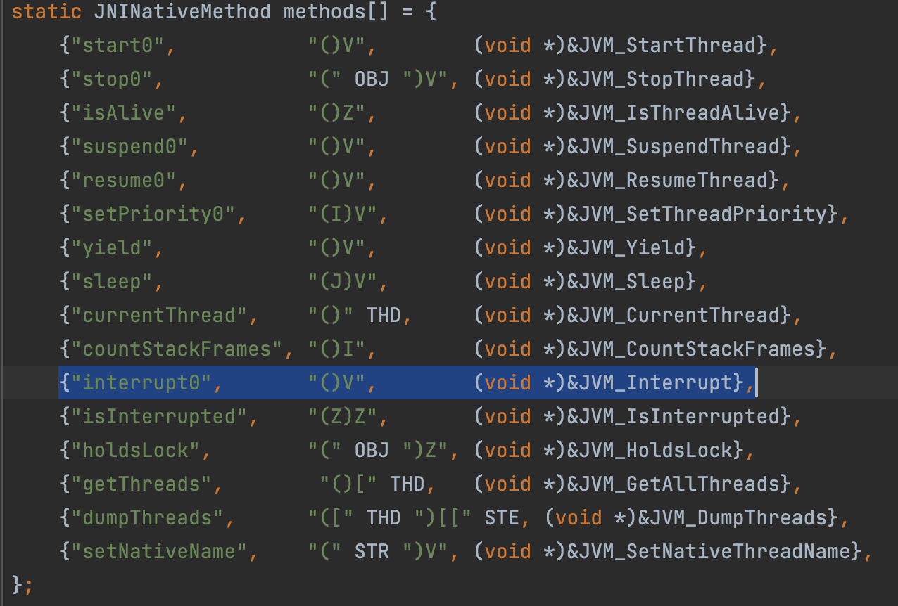

# 1. 线程状态

1. NEW：构造了thread实例，但是还没有start
2. RUNNABLE：线程正在运行或者正等待被cpu执行
3. BLOCKED：线程调用synchronized关键字等待获取monitor锁
4. WAITING：线程调用了无超时的wait、join、park方法
5. TIMED_WAITING：线程调用了有超时的wait、sleep、join、parkNanos、parkUntil 方法
6. TERMINATED：线程终止/完成了运行

# 2. Java 中断机制

## 2.1 中断

Java 没有提供一种安全直接的方法停止某个线程，但是提供了一种中断机制。

中断是一种**协作机制**，也就是说，**中断并不能直接终止另一个线程，而需要被中断的线程自己处理中断**。Java 中断模型中，每个线程对象里面有一个boolean类型的标识（不是Thread类的字段，通过native方法来完成），代表着是否有中断请求（该请求可以来自所有线程，包括被中断的线程本身）。例如，当线程t1想中断线程t2，只需要在线程t1中将线程t2对象的中断标识设为true，然后线程2可以选择在合适的时候处理该中断请求，甚至可以不理会该请求，就像这个线程没有被中断一样。

java.lang.Thread 类提供了几个方法来操作这个中断状态，这些方法包括：

>1. public static boolean interrupted ：测试当前线程是否已经中断。线程的中断状态由该方法清除（也就是说，如果连续两次调用该方法，则第二次调用将返回 false）
>2. public boolean isInterrupted()：测试线程是否已经中断。线程的中断状态不受该方法的影响
>3. public void interrupt()：中断线程，JVM底层做了两件事，设置中断标记为 true，然后唤醒被挂起的线程

其中，**interrupt 方法是唯一能将中断状态设置为true的方法**。静态方法interrupt会将当前线程的中断状态清除，但是这个方法的命名极不直观，容易造成误解。

## 2.2 中断的处理

既然Java中断机制只是设置被中断线程的中断状态，那么被中断线程应该做什么？

一般来说，当可能阻塞的方法声明中有抛出 InterruptedException 则暗示该方法是可中断的，如 BlockingQueue#put、BlockingQueue#take、Object#wait、Thread#sleep等，如果程序捕获到这些可中断的阻塞方法抛出的中断异常或检测到中断后，这些中断信息吹里一般有两个通用原则：

> 1. 如果遇到的是可中断的阻塞方法抛出InterruptedException，可以继续向方法调用栈的上层抛出该异常，
> 2. 如果是检测到中断，则可清除中断状态并抛出InterruptedException，使当前方法也成为一个可中断的方法。

若有时候不太方便在方法上抛出InterruptedException，比如要实现的某个接口中的方法签名上没有throws InterruptedException，这时就可以捕获可中断方法的InterruptedException并通过Thread.currentThread.interrupt()来重新设置中断状态。如果是检测并清除了中断状态，亦是如此。

## 2.3 中断的响应

程序发现中断后该怎么响应？这就得视情况而定了。有些程序可能一检测到中断就立马将线程终止，有些可能是推出当前执行的任务，继续执行下一个任务.....作为一种协作机制，这要与中断方协商好，当调用 interrupt 会发生些什么都是事先知道的，如做一些事物会滚操作，一些清理工作，一些补偿操作等。如果不确定调用某个线程的 interrupt 后线程会做出什么样的响应，那就不应该中断该线程。

## 2.4 Thread.interrupt VS Thread.stop

Thread.stop 方法已经不推荐使用了。而在某些方面 Thread.stop 与中断机制有着相似之处。如当线程在等待内置锁或IO时，stop 跟 interrupt 一样，不会中止这些操作；当 catch 住 stop 导致的异常时，程序也可以继续执行，虽然 stop 本意是要停止线程，这么做会让程序行为变得更加混乱。那么它们的区别在哪里？最重要的就是中断需要程序自己去检测然后做相应的处理，而Thread.stop会直接在代码执行过程中抛出ThreadDeath错误，这是一个java.lang.Error的子类。如果线程当前正持有锁，stop之后则会释放该锁。由于此错误可能出现在很多地方，那么这就让编程人员防不胜防，极易造成对象状态的不一致。

**正是因为可能导致对象状态不一致，stop才被禁用。**

## 2.5 中断的使用

通常，中断的使用场景有以下几个：

1. 点击某个桌面应用中的取消按钮时；
2. 某个操作超过了一定的执行时间限制需要中止时；
3. 多个线程做相同的事情，只要一个线程成功其他线程都可以取消时；
4. 一组线程中的一个或多个出现错误导致整组都无法继续时；
5. 当一个应用或服务需要停止时；

## 2.6 总结

1. 线程正在执行sleep、join、wait等方法，此时线程处在WAITING/TIMED_WAITING状态，当执行thread.interrupt()，那么会抛出InterruptedException异常，线程中断标记位为false，线程停止运行；
2. 线程处在RUNNABLE状态，当执行thread.interrupt()，不会抛出异常，线程中断标记位为true，线程未停止运行；
3. 如果线程处在BLOCKED(Synchronized争抢锁）状态，当执行thread.interrupt()，不会抛出异常，线程中断标记位为true，线程未停止运行（这点也说明了Synchronized不可打断）

## 2.7 中断原理

以Thread.java里的方法Thread.interrupt()为例，最终调用了interrupt0()方法：

```java
private native void interrupt0();
```

可以看出，是native方法，接下来看看怎么找到其JNI实现。在Thread.c里定义了JNI 方法：



interrupt0()方法对应JVM_Interrupt()函数（在jvm.cpp里），在Java 层调用Thread.interrupt()方法，最终底层完成了两件事：

1. 将中断标记位设置为true;
2. 将挂起的线程唤醒;

Java 层的Thread.java里提供了两个方法来查询中断标记位的值，分别是：

```java
#Thread.java
//成员方法
public boolean isInterrupted() {
    return isInterrupted(false);
}

//静态方法
public static boolean interrupted() {
    return currentThread().isInterrupted(true);
}
```

无论是成员方法还是静态方法，最终都调用了Thread.isInterrupted(xx)方法

```java
#Thread.java
//ClearInterrupted 表示是否清空中断标记位
private native boolean isInterrupted(boolean ClearInterrupted);
```

继续跟进isInterrupted(xx)方法

```cpp
#Thread.cpp
bool Thread::is_interrupted(Thread* thread, bool clear_interrupted) {
   return os::is_interrupted(thread, clear_interrupted);
}

#os_linux.cpp
bool os::is_interrupted(Thread* thread, bool clear_interrupted) {
  OSThread* osthread = thread->osthread();
  //查询当前中断值
  bool interrupted = osthread->interrupted();

  if (interrupted && clear_interrupted) {
      //如果参数clear_interrupted 为true，表示要清空标记位
      //则设置标记位为false
      osthread->set_interrupted(false);
  }

  //返回查询到的中断标记位的值
  return interrupted;
}
```

因此，Thread.isInterrupted(xx)方法的作用是：

1. 查询当前线程的中断标记位的值。
2. 根据参数决定是否重置中断标记。

