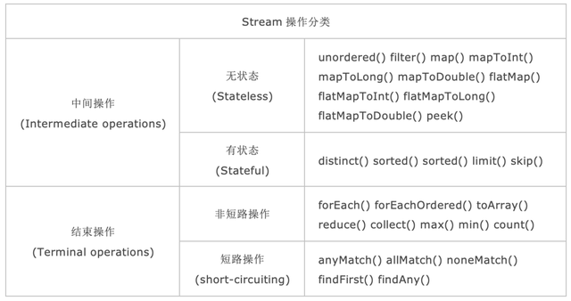
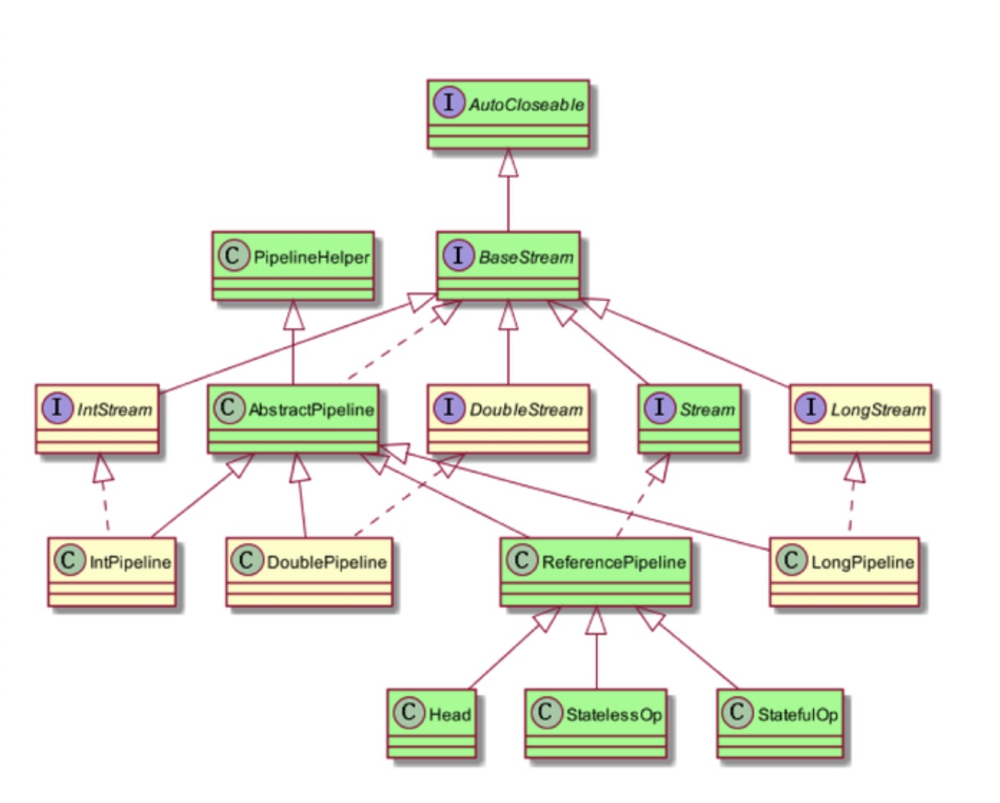

# 1. 操作分类

Stream 中的操作可以分为两大类：**中间操作**（Intermediate operation）与**结束操作**（Terminal operations），中间操作只是对操作进行了记录，只有结束操作才会触发实际的计算（即惰性计算），这也是Stream再迭代大集合时高效的原因之一。中间操作又可以分为**无状态**（Stateless）操作与**有状态**（Stateful）操作，前者是指元素的处理不受之前元素的影响；后者是指该操作只有拿到所有元素之后才能继续下去。结束操作又可以分为**短路**（short-circuuiting）与**非短路**操作，前者是指遇到某些符合条件的元素就可以得到最终结果；而后者是指必须处理所有元素才能得到最终结果。

之所以要进行如此精细的划分，是因为底层对每一种情况的处理方式不同。

BaseStream 定义了流的迭代、并行、串行等基本特性；

Stream 中定义了 map、filter、flatmap 等用户关注的常用操作；

PipelineHelper 用于执行管道流中的操作以及捕获输出类型、并行度等信息，Head、StatelessOp、StatefulOp、StatefulOp 为 ReferencePipeline 中的内部子类，用于描述流的操作阶段。

