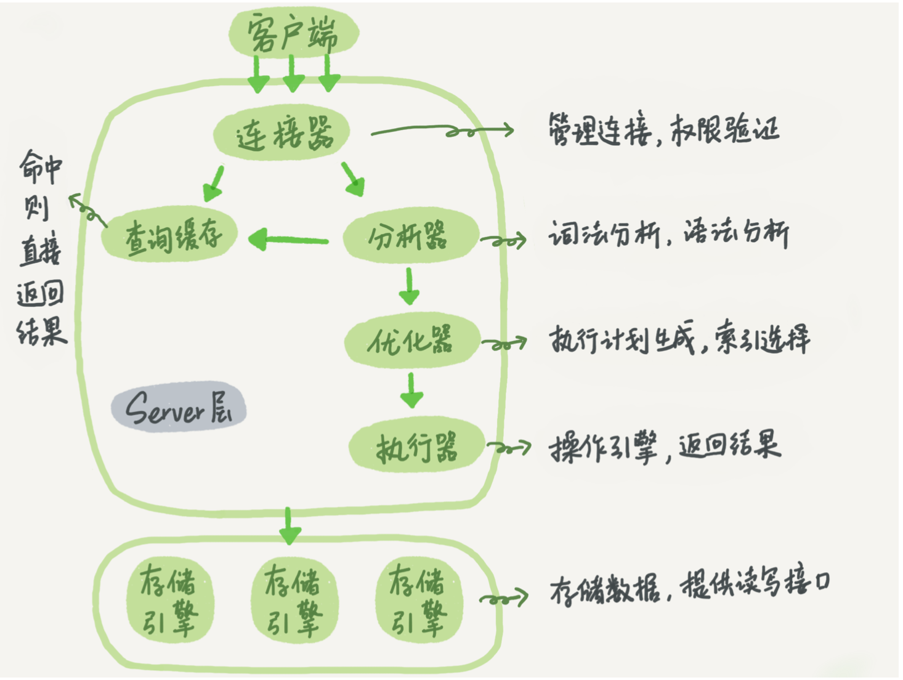
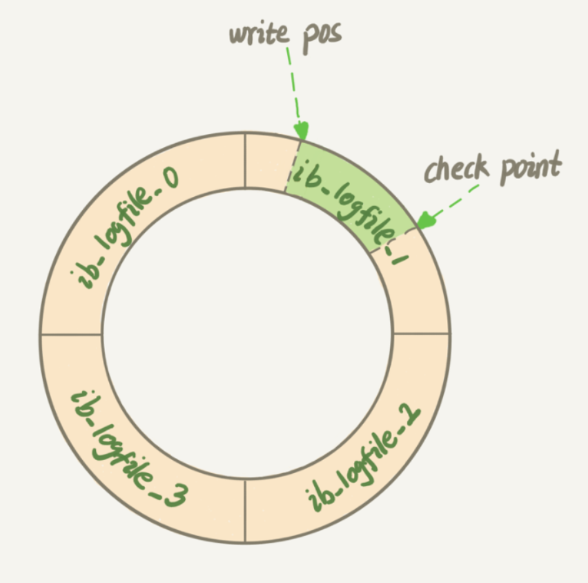
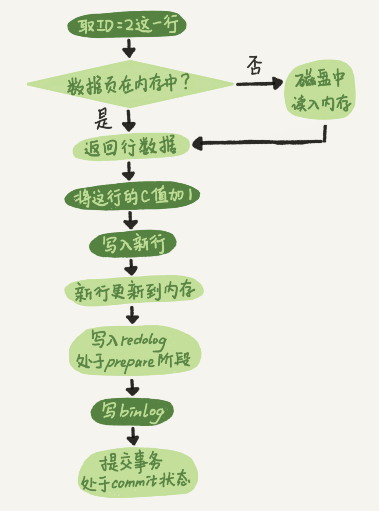

# 1. 一条SQL查询语句的执行

Mysql 的逻辑架构图：

大体来说，MySql 可以分为 Server 层和存储引擎层两部分。

Server 层包括连接器、查询缓存、分析器、优化器、执行器等，涵盖 MySql 的大多数核心服务功能，以及所有的内置函数（如日期、时间、数学和加密函数等），所有跨存储引擎的功能都在这一层实现，比如存储过程、触发器、视图等。

而存储引擎层负责数据的存储和提取。其架构模式是插件式的，支持 InnoDB、MyISAM、Memory 等多个存储引擎。现在最常用的存储引擎是 InnoDB，它从 MySQL 5.5.5 版本开始成为了默认存储引擎。

## **连接器**

第一步，连接到数据库接触到的就是连接器。连接器负责跟客户端建立连接、获取权限、维持和管理连接。在完成 TCP 握手后，连接器就要开始认证身份，如果用户密码认证通过，连接器会到权限表查询所拥有的权限。之后这个连接里面的权限判断逻辑，都将依赖于此时读取到的权限。这意味着，一个用户成功建立连接后，即使修改了他的权限，也只有新建的连接才能使用新的权限限制。

## **查询缓存**

连接建立完成后，就可以执行查询语句了，执行逻辑来到第二步：查询缓存。需要注意的是，MySQL 8.0 版本开始彻底没有这块功能了。

## **分析器**

分析器先会做“**词法分析**”，MySql 需要识别 SQL 语句里的字符串分别是什么，代表什么。如识别出 SELECT 关键字、表名、列名等。

做完这些识别后，就要做“**语法分析**”。根据词法分析的结果，语法分析器会根据语法规则，判断这个 SQL 是否满足 MySql 语法。

## **优化器**

经过了分析器，MySql 就知道要做什么。在开始执行之前，还要先经过优化器的处理。

优化器是在表里面有多个索引的时候，决定使用哪个索引；或者在一个语句有多表关联（join）的时候，决定各个表的连接顺序。

## **执行器**

开始执行的时候，要先判断一下对这个表是否有执行查询的权限，如果没有，就会返回没有权限的错误。（在工程实现上，如果命中缓存，会在查询缓存返回结果的时候，做权限验证。查询也会在优化器之前调用 precheck 验证权限）。

如果有权限，就打开表继续执行。打开表的时候，执行器就会根据表的引擎定义，去使用这个引擎提供的接口。

# 2. 一条SQL更新语句的执行

与查询流程不一样的是，更新流程还涉及两个重要的日志模块：**redo log（重做日志）**和 **binlog（归档日志）**。

## redo log

在 Mysql 中，如果每一次更新操作都需要写进磁盘，然后磁盘也要找到对应的那条记录，然乎再更新，整个过程 IO 成本、查找成本都很高。为了解决这个问题，Mysql 使用了 **WAL** 技术（**Write-Ahead-Log**），它的关键就是先写日志，再写磁盘。

具体来说，当有一条记录需要更新的时候，InnoDB 引擎就会先把记录写到 redo log 里面，并更新内存，这个时候更新就算完成了。同时，InnoDB 引擎会在适当的时候，将这个操作记录更新到磁盘中。

InnoDB 的 redo log 是固定大小的，比如可以配置为一组 4 个文件，每个文件的大小是 4 GB，那么它就可以记录 4GB 的操作。从头开始写，写到末尾就又回到开头循环写：

write pos 是当前记录的位置，一边写一边后移，写到 3 号文件末尾后就回到 0 号文件开头。check point 是当前要擦除的位置，也是往后推移并且循环的，擦除记录前要把记录更新到数据文件。

write pos 和 checkpoint 之间还空着的部分，可以用来记录新的操作。如果 write pos 追上了 checkpoint 这个时候不能再执行新的更新，得停下来先擦掉一些记录，把 checkpoint 推进一下。

有了 redo log，InnoDB 就可以保证即使数据库发生异常重启，之前的提交记录都不会丢失，这个能力成为 **crash-safe**。

## binlog

我们知道，Mysql 整体来看，其实就有两块：一块 Server 层，它主要做的是 Mysql 功能层面的事情；还有一块是引擎层，负责存储相关的具体事宜。redo log 是 InnoDB 引擎特有的日志，而 Server 层也有自己的日志，称为 binlog（归档日志）。

为什么会有两份日志呢？

因为最开始 Mysql 里面没有 InnoDB 引擎。Mysql 自带的引擎是 MyISAM，但是 MyISAM 没有 crash-safe 能力，binlog 日志只能用于归档。而 InnoDB 是另一家公司以插件的形式引入 Mysql 的，既然只依靠 binlog 是没有 crash-safe 能力的，所以 InnoDB 使用另外一种日志系统——也就是 redo-log 来实现 crash-safe 能力。

这两种日志有以下三点不同：

- redo log 是 InnoDB 引擎特有的；binlog 是 Mysql 的 server 层实现的，所有引擎都可以使用。
- redo log 是 物理日志，记录的是 “在某个数据页上做了什么修改”；binlog 是逻辑日志，记录的是这个语句的原始逻辑。
- redo log 是循环写的，空间固定会用完；binlog 是可以追加写入的。“追加写” 是指 binlog 文件写到一定大小后会切换到下一个，并不会覆盖以前的日志。

以 update T set c = c+1 where ID =2；我们再来看看执行器和 InnoDB 引擎在执行这个简单的 update 语句时的内部流程：

1. 执行器先找引擎 ID = 2 这一行。ID 是主键，引擎直接用树搜索找到这一行。如果 ID = 2 这一行所在的数据页本来就在内存中，就直接返回给执行器；否则，需要先从磁盘读入内存，然后再返回。
2. 执行器拿到引擎给的行数据，把这个值加上 1，得到一行新的数据，再调用引擎接口写入这行新数据。
3. 引擎将这行数据更新到内存中，同时将这个更新操作记录到 redo log 里面，此时 redo log 处于 prepare 状态。然后告知执行器完成了，随时可以提交事务。
4. 执行器生成这个操作的 binlog，并把 binlog 写入磁盘。
5. 执行器调用引擎的提交事务接口，引擎把刚刚写入的 redo log 改成提交（commit）状态，更新完成。

**最后三步将 redo log 的写入拆成了两个步骤： prepare 和 commit，这就是 “两阶段提交”。**

redo log 用于保证 crash-safe 能力。innodb_flush_log_at_trx_commit 这个参数设置成 1 的时候，表示每次事务的 redo log 都直接持久化到磁盘。sync_binlog 这参数设置成 1 的时候，表示每次事务的 binlog 都持久化到磁盘。

