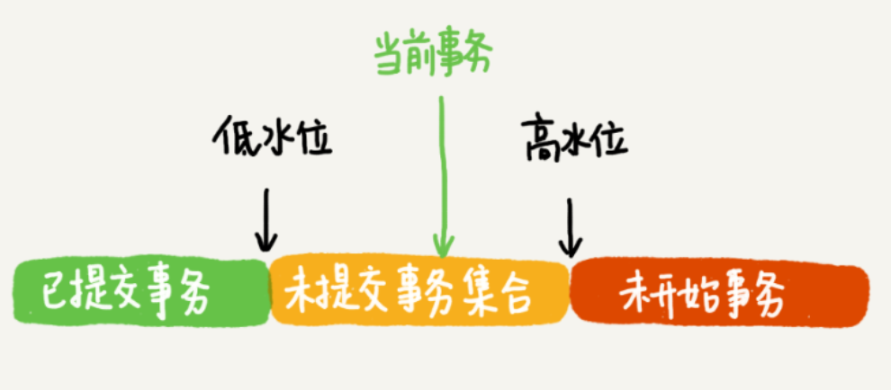

# MVCC 工作原理

在 Msyql 里，有两个 “视图” 的概念：

- 一个是 view，它是用一个查询语句定义的虚拟表，在调用的时候执行查询语句并生成结果。创建视图的语法是 creat view，而它的查询方法与表一样
- 另一个是 InnoDB 在实现 MVCC 时用到的一致性视图，即 consistent read view，用与支持 RC（Read Committted，读提交）和 RR（Repeatable Read，可重复读）隔离级别的实现

它没有物理结果，作用是事务执行期间来定义 “能看到什么数据”。

InnoDB 里面每个事务有一个唯一的事务 ID，叫做 transaction id。它是在事务开始的时候向 InnoDB 的事务系统申请的，是按照申请顺序严格递增的。

而每行数据也都有多个版本。每次事务更新数据的时候，都会生成一个新的数据版本，并且把 transaction id 赋值给这个数据版本的事务 ID，记为 row trx_id。同时，旧的数据版本要保留，并且在新的数据版本中，能够有信息可以直接拿到它。

**也就是说，数据表中的一行记录，其实可能有多个版本，每个版本有自己的 row trx_id。**

旧版本数据并不是物理上真实存在的，而是每次需要的时候根据当前版本和 undo log 计算出来的。

按照可重复读的定义，一个事务启动的时候，能够看到所有已提交的事务结果。但是之后，这个事务执行期间，其他事务的更新对它不可见。因此，一个事务只需要在启动的时候声明，以启动的时刻为准，如果一个数据版本是在启动之前生成的，就认；如果是启动后生成的，就不认，必须要找到它的上一个版本，如果上一个版本也不可见，那就继续往前找，如果是这个事务自己更新的数据，它自己还是要认的。

在实现上，InnoDB 为每个事务构造了一个数组，用来保存这个事务启动瞬间，当前正在活跃的所有事务 ID（活跃指的是，启动了但还没提交）。

**数组里面事务 ID 的最小值记为低水位，当前系统里面已经创建过的事务 ID 最大值加 1 记为高水位。**这个视图数据和高水位，就组成了当前事务的一致性视图（read-view）。而数据版本的可见性规则，就是基于数据的 row trx_id 和这个一致性视图的对比结果得到的。

这个视图数组吧所有的 row_trx_id 分成了几种不同的情况：

- 如果落在绿色部分（row_trx_id 小于低水位），表示这个版本是已提交的事务或者是当前事务自己生成的，这个数据是可见的；

- 如果落在红色部分（row_trx_id 大于高水位），表示这个版本是有将来启动的事务生成的，是肯定不可见的；

- 如果落在黄色部分（row_trx_id 在高低水位之间），包含两种情况

  a. 若 row_trx_id 在数组中，表示这个版本是由其他还没提交的事务生成的，不可见；

  b. 若 row_trx_id 不在数组中，表示这个版本是已经提交了的事务生成的，可见。

读提交的逻辑和可重复读的逻辑类似，它们最主要的区别是：

- 在可重复读隔离级别下，只需要在事务开始的时候创建一致性视图，之后事务里的其他查询都共用这个一致性视图；
- 在读提交隔离级别下，每一个语句执行前都会重新计算一个新的视图。