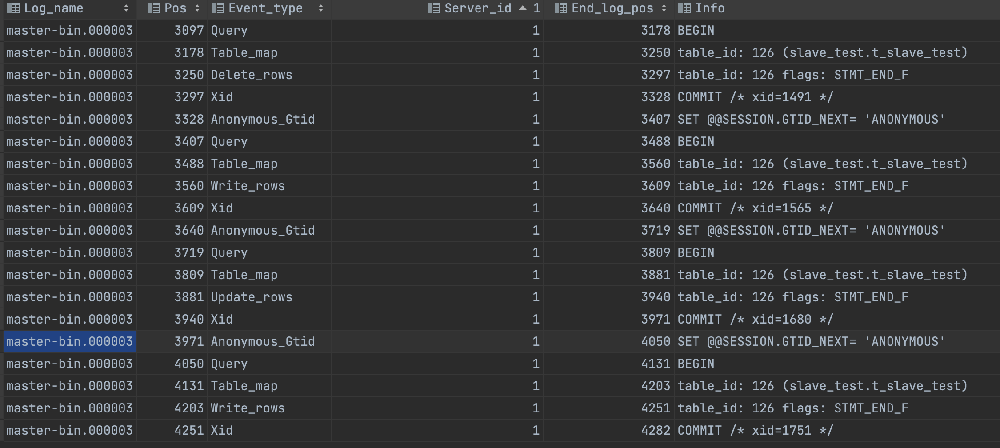
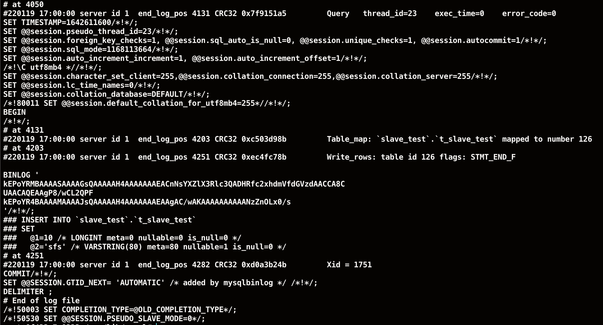

# binlog的三种格式

binlog 有三种格式，statement、row、mixed（前两种格式的混合）。通过 show variables like 'binlog_format'; 语句查看。

查看 binlog 文件内容：

```sql
show binlog events in 'master-bin.000003';
```

结果：



## statement 格式

在 statement 格式下，记录到 binlog 里面的是语句原文。因此可以会出现这样一种情况：在主库执行一条 SQL 语句的时候，用的是索引 a；而在备库执行这条 SQL 语句的时候，却使用了索引 b，因此 Mysql 认为这样写是有风险的，可能导致主备不一致，典型的就是 delete 带 limmit 。

## row 格式

而在 row 格式下，binlog 里面没有了 sql 语句的原文，而是替换成了两个 event：Table_map 和 Delete_rows、Update_rows、Write_rows 等。

- Table_map event：用于说明接下来操作的表是哪个库的哪个表
- Delete_rows_event、Update_rows、Write_rows：用于定义删除、更新、写入的行为

可以借助 mysqlbinlog 工具解析和查看 binlog 的内容：

```sql
mysqlbinlog --no-defaults -vv master-bin.000003 --start-position=4050
```

结果：



从图中可以看到以下几个信息：

- server id 1，表示这个事务是在 server_id = 1 的这个库上执行的
- 每个 event 都有 CRC32 值，这是因为 binlog_checkusm 设置为 CRC32 了
- Table_map_event 显示了接下来要打开的表，map 到数字 126
- 在 mysqlbinlog 命令中，使用了 -vv 参数是为了把内容都解析出来，所以从结果里面可以看到各个字段的值（比如，@1=10，@2='sfs'）
- 最后的 Xid event  用于表示事务被正确地提交了

当 binlog 使用 row 格式时候，binlog 里面记录了真实操作行的主键id，这样 binlog 传到备库去的时候，不会有主备执行不一致的问题。

## mixed 格式

因为有些 statement 格式的 binlog 可能会导致主备不一致，所以要使用 row 格式。

但 row 格式的缺点是，很占空间。比如你用一个 delete 语句删除 10w 行数据，用 statement 记录的话就是一个 SQL 语句被记录到 binlog 中，占用几十个字节的空间。但如果用 row 格式的 binlog，就要把这 10w 条记录都写到 binlog 中。这样做，不仅会占用更大的空间，同时写 binlog 也要耗费 IO 资源，影响执行速度。

所以，Mysql 就取了个折中方案，也就是又了 mixed 格式的 binlog。mixed 格式的意思是，Mysql 自己会判断这条 sql 语句是否可能引起主备不一致，如果有可能，就用 row 格式，否则就用 statement 格式。

也就是说，mixed 格式可以利用 statement 格式的优点，同时又避免了数据不一致的风险。

但是，现在越来越多的场景要求把 Msyql 的 binlog 格式设置成 **row**。这么做的理由有很多，比如：**恢复数据**，因为 row 格式保存的是完成的行记录，所以更有利于恢复数据。

