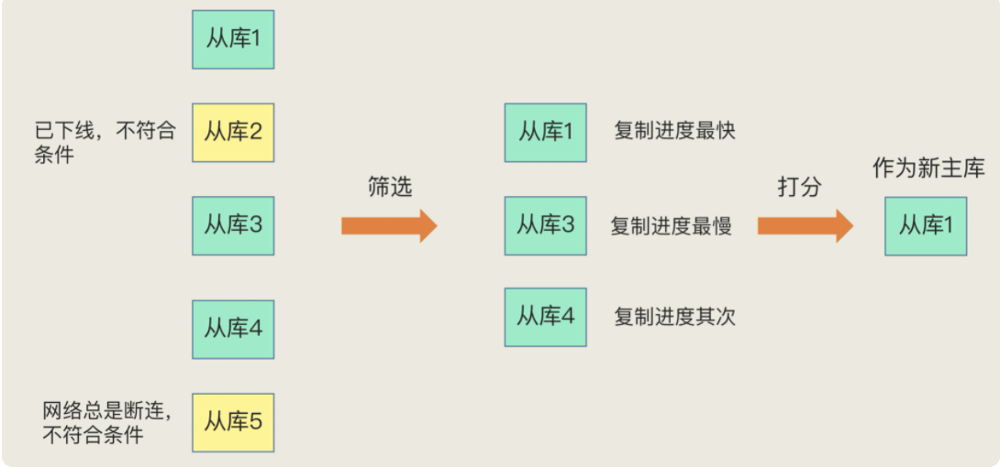

## 1. Redis数据类型

**1.1 Redis 键值对中值的数据结构**：

String（字符串）、List（列表）、Hash（哈希）、Set（集合）、Sorted Set（有序集合）

**1.2 Redis 底层数据结构**

简单字符串、双向链表、压缩列表、哈希表、跳表和整数数组。对应关系如下：


**1.3 键和值的组织结构**

为了实现从键到值的快速访问，Redis 使用了一个哈希表来保存所有键值对，哈希桶中保存的元素并不是值本身，而是指向具体值的指针。


## 2. Redis I/O 模型

Redis 所谓的单线程并不是指 Redis 进程只有一个线程，而是说，Redis 的 I/O 和 请求处理用的是一个线程。

Redis单线程处理IO请求性能瓶颈主要包括 2 个方面：

- 任意一个请求在server中一旦发生耗时，都会影响整个server的性能，也就是说后面的请求都要等前面这个耗时请求处理完成，自己才能被处理到。
  
  > 耗时的操作包括以下几种： 
  >
  > 1. 操作bigkey：写入一个bigkey在分配内存时需要消耗更多的时间，同样，删除bigkey释放内存同样会产生耗时；
  > 2. 使用复杂度过高的命令：例如SORT/SUNION/ZUNIONSTORE，或者O(N)命令，但是N很大，例如 lrange key 0 -1一次查询全量数据； 
  > 3. 大量key集中过期：Redis的过期机制也是在主线程中执行的，大量key集中过期会导致处理一个请求时，耗时都在删除过期key，耗时变长；
  > 4. 淘汰策略：淘汰策略也是在主线程执行的，当内存超过Redis内存上限后，每次写入都需要淘汰一些key，也会造成耗时变长；
  > 5. AOF刷盘开启always机制：每次写入都需要把这个操作刷到磁盘，写磁盘的速度远比写内存慢，会拖慢Redis的性能； 
  > 6. 生成RDB（主从全量同步或者save/bgsave）：虽然采用fork子进程生成数据快照，但fork这一瞬间也是会阻塞整个线程的，实例越大，阻塞时间越久；
  
- 并发量非常大时，单线程读写客户端IO数据存在性能瓶颈，虽然采用IO多路复用机制，但是读写客户端数据依旧是同步IO，只能单线程依次读取客户端的数据，无法利用到CPU多核。 

针对第一个问题，一方面需要业务人员去规避，一方面Redis在4.0推出了lazy-free机制，把bigkey释放内存的耗时操作放在了异步线程中执行，降低对主线程的影响。 

针对第二个问题Redis在 6.0 推出了多线程，可以在高并发场景下利用CPU多核多线程读写客户端数据，进一步提升server性能，当然，只是针对客户端的读写是并行的，每个命令的真正操作依旧是单线程的。

## 3. AOF 日志

Redis 持久化主要有 2 大机制，即 AOF（Append Only File）和 RDB 快照

说到日志，我们比较熟悉的是数据库的写前日志（Write Ahead Log，WAL），也就是说，在实际写数据前，先把修改的数据记录到日志中，以便故障时进行恢复。不过，AOF 日志正好相反，它是写后日志，即 Redis 是先执行命令，把数据写入内存，之后才记录日志。

为什么这么做呢？传统数据库的日志，例如 redo log，记录的是修改后的数据，而 AOF 日志记录的是 Redis 执行的命令，这些命令是以文本的方式保存的。但是为了避免额外的检查开销，Redis 在向 AOF 记日志的时候，并不会做语法检查。所以，如果先记录日志再执行命令的话，日志中就有可能会记录了错误的命令，在后续 Redis 使用日志进行恢复的时候就有可能出错。此外，AOF 还有一个好处就是，它是在命令执行完后才记录日志的，所以不会阻塞当前的写操作。

但是，AOF 也有两个潜在的风险：一是可能会造成数据丢失，二是AOF虽然避免了对当前命令的阻塞，但是可能会给下一个操作带来阻塞风险。因为AOF 日志也是在主线程中执行的，如果在把日志文件写入磁盘时，磁盘写压力大，就会导致写盘很慢，进而导致后续的操作也无法执行了。

**三种写回策略**

AOF 配置项 appendfsync 有三个可选项：

- **Always**，同步写回：每个写命令执行完，立马同步地将日志写回磁盘；可以做到基本不丢数据，但是它在每一个写命令后都有一个慢速的落盘操作，不可避免地会影响主线程性能；
- **Everysec**，每秒写回：每个写命令执行完，只是先把日志写到 AOF 文件的内存缓冲区，每隔一秒把缓冲区中的内容写入磁盘；采用一秒写回一次的频率，避免了“同步写回”的性能开销，虽然减少了对系统性能的影响，但是如果发生宕机，上一秒内未落盘的命令操作仍然会丢失。所以，这只能算是，在避免影响主线程性能和避免数据丢失两者间取了个折中。
- **No**，操作系统控制的写回：每个写命令执行完，只是先把日志写到 AOF 文件的内存缓冲区，由操作系统决定何时将缓冲区内容写回磁盘。虽然在写完缓冲区后，就可以继续执行后续的命令，但是落盘的时机已经不在 Redis 手中了，只要 AOF 记录没有写回磁盘，一旦宕机对应的数据就丢失了；

但是，按照系统的性能需求选定了写回策略，并不是没有其他问题了。还有会有 AOF 文件过大带来的性能问题。主要在于以下三个方面：一是，文件系统本身对文件大小有限制，无法保存过大的文件；二是，如果文件太大，之后再往里面追加命令记录的话，效率也会变低；三是，如果发生宕机，AOF 中记录的命令要一个个被重新执行，用于故障恢复，如果日志文件太大，整个恢复过程就会非常缓慢，这就会影响到 Redis 的正常使用。

**AOF 相关配置**

```
auto-aof-rewrite-min-size 64mb
#AOF文件最小重写大小，只有当AOF文件大小大于该值时候才可能重写,4.0默认配置64mb。

auto-aof-rewrite-percentage  100
#当前AOF文件大小和最后一次重写后的大小之间的比率等于或者等于指定的增长百分比，如100代表当前AOF文件是上次重写的两倍时候才重写。

appendfsync everysec
#no：不使用fsync方法同步，而是交给操作系统write函数去执行同步操作，在linux操作系统中大约每30秒刷一次缓冲。这种情况下，缓冲区数据同步不可控，并且在大量的写操作下，aof_buf缓冲区会堆积会越来越严重，一旦redis出现故障，数据
#always：表示每次有写操作都调用fsync方法强制内核将数据写入到aof文件。这种情况下由于每次写命令都写到了文件中, 虽然数据比较安全，但是因为每次写操作都会同步到AOF文件中，所以在性能上会有影响，同时由于频繁的IO操作，硬盘的使用寿命会降低。
#everysec：数据将使用调用操作系统write写入文件，并使用fsync每秒一次从内核刷新到磁盘。 这是折中的方案，兼顾性能和数据安全，所以redis默认推荐使用该配置。

aof-load-truncated yes
#当redis突然运行崩溃时，会出现aof文件被截断的情况，Redis可以在发生这种情况时退出并加载错误，以下选项控制此行为。
#如果aof-load-truncated设置为yes，则加载截断的AOF文件，Redis服务器启动发出日志以通知用户该事件。
#如果该选项设置为no，则服务将中止并显示错误并停止启动。当该选项设置为no时，用户需要在重启之前使用“redis-check-aof”实用程序修复AOF文件在进行启动。

appendonly no 
#yes开启AOF，no关闭AOF

appendfilename appendonly.aof
#指定AOF文件名，4.0无法通过config set 设置，只能通过修改配置文件设置。

dir /etc/redis
#RDB文件和AOF文件存放目录

优势：可以保证数据的一致性。因为它可以实时或者每秒记录客户端对redis的操作
缺点：aof文件比rdb文件大，恢复速度慢
```


**AOF 重写机制**

为了避免 AOF 文件持续增大造成的性能问题，AOF 使用了重写机制。AOF 重写是根据 Redis 现状创建一个新的 AOF 文件（相当于只记录了键值最新的变化，忽略掉 AOF 文件之前对这个键值的操作，具有多变一的作用）。

**AOF 重写会阻塞吗**

虽然 AOF 重写后，日志文件会越来越小，但是，要把整个数据库的最新数据都写回磁盘，仍然是个非常耗时的过程。这时我们就要考虑一个问题，重写会不会阻塞主线程？AOF非阻塞的重写过程如下图：


每次 AOF 重写时，Redis 会先执行一个内存拷贝（Copy On Write，实际上是拷贝内存页表即虚拟内存和物理内存的映射索引表），用于重写；然后，使用两个日志保证在重写过程中，新写入的数据不会丢失。而且，因为 Redis 采用额外的线程进行数据重写，所以，这个过程并不会阻塞主线程。但是，这个过程还是会有阻塞的风险的。

Redis采用fork子进程重写AOF文件时，潜在的阻塞风险包括：fork子进程 和 AOF重写过程中父进程产生写入的场景。 	

- fork子进程，fork这个瞬间一定是会阻塞主线程的（注意，fork时并不会一次性拷贝所有内存数据给子进程），fork采用操作系统提供的写时复制 (Copy On Write) 机制，就是为了避免一次性拷贝大量内存数据给子进程造成的长时间阻塞问题，但fork子进程需要拷贝进程必要的数据结构，其中有一项就是拷贝内存页表（虚拟内存和物理内存的映射索引表），这个拷贝过程会消耗大量CPU资源，拷贝完成之前整个进程是会阻塞的，阻塞时间取决于整个实例的内存大小，实例越大，内存页表越大，fork阻塞时间越久。拷贝内存页表完成后，子进程与父进程指向相同的内存地址空间，也就是说此时虽然产生了子进程，但是并没有申请与父进程相同的内存大小。那什么时候父子进程才会真正内存分离呢？“写实复制”顾名思义，就是在写发生时，才真正拷贝内存真正的数据，这个过程中，父进程也可能会产生阻塞的风险，就是下面介绍的场景。 	

- fork出的子进程指向与父进程相同的内存地址空间，此时子进程就可以执行AOF重写，把内存中的所有数据写入到AOF文件中。但是此时父进程依旧是会有流量写入的，如果父进程操作的是一个已经存在的key，那么这个时候父进程就会真正拷贝这个key对应的内存数据，申请新的内存空间，这样逐渐地，父子进程内存数据开始分离，父子进程逐渐拥有各自独立的内存空间。因为内存分配是以页为单位进行分配的，默认4k，如果父进程此时操作的是一个bigkey，重新申请大块内存耗时会变长，可能会产阻塞风险。另外，如果操作系统开启了内存大页机制(Huge Page，页面大小2M)，那么父进程申请内存时阻塞的概率将会大大提高，所以在Redis机器上需要关闭Huge Page机制。Redis每次fork生成RDB或AOF重写完成后，都可以在Redis log中看到父进程重新申请了多大的内存空间。 

**AOF 重写也有一个重写日志，为什么它不共享使用 AOF 本身的日志呢？**

AOF重写不复用AOF本身的日志，一个原因是父子进程写同一个文件必然会产生竞争问题，控制竞争就意味着会影响父进程的性能。二是如果AOF重写过程中失败了，那么原本的AOF文件相当于被污染了，无法做恢复使用。所以Redis AOF重写一个新文件，重写失败的话，直接删除这个文件就好了，不会对原先的AOF文件产生影响。等重写完成之后，直接替换旧文件即可。

## 4. RDB 内存快照

在使用 AOF 进行故障恢复会有性能问题。Redis 提供了另外一种持久化方式：**RDB 内存快照**

Redis 提供两个命令来生成 RDB 文件，分别是 save 和 bgsave


默认情况下，RDB bgsave 如果执行失败（权限或者文件等问题），Redis 会停止接收所有写入请求，可将 stop-writes-on-bgsave-error 设置为 false

**RDB相关配置**

```
save m n
#配置快照(rdb)促发规则，格式：save <seconds> <changes>
#save 900 1  900秒内至少有1个key被改变则做一次快照
#save 300 10  300秒内至少有300个key被改变则做一次快照
#save 60 10000  60秒内至少有10000个key被改变则做一次快照
#关闭该规则使用svae “” 

#rdb持久化存储数据库文件名，默认为dump.rdb
dbfilename  dump.rdb

#yes代表当使用bgsave命令持久化出错时候停止写RDB快照文件,no表明忽略错误继续写文件。
stop-write-on-bgsave-error yes 

#在写入文件和读取文件时是否开启rdb文件检查，检查是否有无损坏，如果在启动是检查发现损坏，则停止启动。
rdbchecksum yes

#数据文件存放目录，rdb快照文件和aof文件都会存放至该目录，请确保有写权限
dir "/etc/redis"

#是否开启RDB文件压缩，该功能可以节约磁盘空间
rdbcompression yes   
```


RDB 有个问题就是快照间隔时间不太好设置，太低会导致数据丢失，太高会带来性能影响

## 5. AOF和 RDB 混合使用

为了协调高性能和高可靠，**Redis 4.0** 中提出一个混合使用 AOF 和 RDB 的方式，内存快照以一定频率执行，在两次快照之间，使用 AOF 日志记录这段时间的所有命令操作（快照之后清空AOF 文件即可）。

开启方式：aof-use-rdb-preamble true

## 6. 扩展，一道场景题：

Q：我们使用一个 2 核 CPU、4GB 内存、500GB 磁盘的云主机运行 Redis，Redis 数据库的数据量大小差不多是 2GB，我们使用了 RDB 做持久化保证。当时 Redis 的运行负载以修改操作为主，写读比例差不多在 8:2 左右，也就是说，如果有 100 个请求，80 个请求执行的是修改操作。你觉得，在这个场景下，用 RDB 做持久化有什么风险吗？

A1：2核CPU、4GB内存、500G磁盘，Redis实例占用2GB，写读比例为8:2，此时做RDB持久化，产生的风险主要在于 CPU资源 和 内存资源 这2方面： a、内存资源风险：Redis fork子进程做RDB持久化，由于写的比例为80%，那么在持久化过程中，“写时复制”会重新分配整个实例80%的内存副本，大约需要重新分配1.6GB内存空间，这样整个系统的内存使用接近饱和，如果此时父进程又有大量新key写入，很快机器内存就会被吃光，如果机器开启了Swap机制，那么Redis会有一部分数据被换到磁盘上，当Redis访问这部分在磁盘上的数据时，性能会急剧下降，已经达不到高性能的标准（可以理解为武功被废）。如果机器没有开启Swap，会直接触发OOM，父子进程会面临被系统kill掉的风险。 b、CPU资源风险：虽然子进程在做RDB持久化，但生成RDB快照过程会消耗大量的CPU资源，虽然Redis处理处理请求是单线程的，但Redis Server还有其他线程在后台工作，例如AOF每秒刷盘、异步关闭文件描述符这些操作。由于机器只有2核CPU，这也就意味着父进程占用了超过一半的CPU资源，此时子进程做RDB持久化，可能会产生CPU竞争，导致的结果就是父进程处理请求延迟增大，子进程生成RDB快照的时间也会变长，整个Redis Server性能下降。 c、另外，可以再延伸一下，问题没有提到Redis进程是否绑定了CPU，如果绑定了CPU，那么子进程会继承父进程的CPU亲和性属性，子进程必然会与父进程争夺同一个CPU资源，整个Redis Server的性能必然会受到影响！所以如果Redis需要开启定时RDB和AOF重写，进程一定不要绑定CPU

A2：1，内存压力，在生成RDB时，fork的子进程虽然不会拷贝父进程的所有内存，但会拷贝PCB，虽然父进程采用cow，这个redis实例中，写请求占了80，会产生大量内存拷贝，加上操作系统本身占用，内存负载很大，很容易出现内存不足的情况，如果开启了swap，内存会被置换到磁盘上，访问速度变慢，更为严重的情况下，会出现OOM，进程会被随机killed，加上CPU核数不多，进程处理数据速度有限，会进入恶性循环，进而影响redis对外提供的服务 2.磁盘压力，这个redis数据库写请求过多，极端情况下，上一次内存快照生成一段时间后，80的数据变为脏数据，为了保证可靠性，需要提高备份频率，在影响性能的同时，也会产生大量文件，aof混合模式下，由于aof是文本文件，本身占用空间大，可能会导致磁盘占满 3.处理能力，2CPU的计算能力有限，算力不足，会导致处理速度慢，影响处理时延

## 7. 主从复制原理

Redis 提供了主从库模式，以保证数据副本的一致，主从库之间采用的是读写分离的方式。

Redis 的主从库同步有三种模式：**全量复制、基于长连接的命令传播、增量复制**

### **7.1 主从第一次同步使用全量复制**


1. 具体来说，从库给主库发送 psync 命令，表示要进行数据同步，主库根据这个命令的参数来启动复制。psync 命令包含了主库的 runID 和复制进度 offset 两个参数。

   runID，是每个 Redis 实例启动时都会自动生成的一个随机 ID，用来唯一标记这个实例。当从库和主库第一次复制时，因为不知道主库的 runID，所以将 runID 设为“？”。

   offset，此时设为 -1，表示第一次复制。

   主库收到 psync 命令后，会用 FULLRESYNC 响应命令带上两个参数：主库 runID 和主库目前的复制进度 offset，返回给从库。从库收到响应后，会记录下这两个参数。这里有个地方需要注意，FULLRESYNC 响应表示第一次复制采用的全量复制，也就是说，主库会把当前所有的数据都复制给从库。

2. 在第二阶段，主库将所有数据同步给从库。从库收到数据后，在本地完成数据加载。这个过程依赖于内存快照生成的 RDB 文件。具体来说，主库执行 bgsave 命令，生成 RDB 文件，接着将文件发给从库。从库接收到 RDB 文件后，会先清空当前数据库，然后加载 RDB 文件。这是因为从库在通过 replicaof 命令开始和主库同步前，可能保存了其他数据。为了避免之前数据的影响，从库需要先把当前数据库清空。

   在主库将数据同步给从库的过程中，主库不会被阻塞，仍然可以正常接收请求。否则，Redis 的服务就被中断了。但是，这些请求中的写操作并没有记录到刚刚生成的 RDB 文件中。为了保证主从库的数据一致性，主库会在内存中用专门的 replication buffer，记录 RDB 文件生成后收到的所有写操作。

3. 最后，也就是第三个阶段，主库会把第二阶段执行过程中新收到的写命令，再发送给从库。具体的操作是，当主库完成 RDB 文件发送后，就会把此时 replication buffer 中的修改操作发给从库，从库再重新执行这些操作。这样一来，主从库就实现同步了。

**主从级联模式分担全量复制时的主库压力**

上面的主从库模式中，所有的从库都是和主库连接，所有的全量复制也都是和主库进行的。现在，我们可以通过“主 - 从 - 从”模式将主库生成 RDB 和传输 RDB 的压力，以级联的方式分散到从库上。

### **7.2 基于长连接的命令传播**

一旦主从库完成了全量复制，它们之间就会一直维护一个网络连接，主库会通过这个连接将后续陆续收到的命令操作再同步给从库，这个过程也称为基于长连接的命令传播，可以避免频繁建立连接的开销。

但不可忽视的是，这个过程中存在着风险点，最常见的就是网络断连或阻塞。如果网络断连，主从库之间就无法进行命令传播了，从库的数据自然也就没办法和主库保持一致了，客户端就可能从从库读到旧数据。

**主从库间网络断了怎么办？**

在 Redis 2.8 之前，如果主从库在命令传播时出现了网络闪断，那么，从库就会和主库重新进行一次全量复制，开销非常大。从 Redis 2.8 开始，网络断了之后，主从库会采用增量复制的方式继续同步。

### 7.3 增量复制

那么，增量复制时，主从库之间具体是怎么保持同步的呢？这里的奥妙就在于 repl_backlog_buffer 这个缓冲区。

我们先来看下它是如何用于增量命令的同步的。当主从库断连后，主库会把断连期间收到的写操作命令，写入 **repl_backlog_buffer** 这个缓冲区（断连之后没有 replication buffer 这个缓冲区了）。repl_backlog_buffer 是一个环形缓冲区，主库会记录自己写到的位置，从库则会记录自己已经读到的位置。刚开始的时候，主库和从库的写读位置在一起，这算是它们的起始位置。

随着主库不断接收新的写操作，它在缓冲区中的写位置会逐步偏离起始位置，我们通常用偏移量来衡量这个偏移距离的大小，对主库来说，对应的偏移量就是 master_repl_offset。主库接收的新写操作越多，这个值就会越大。同样，从库在复制完写操作命令后，它在缓冲区中的读位置也开始逐步偏移刚才的起始位置，此时，从库已复制的偏移量 slave_repl_offset 也在不断增加。正常情况下，这两个偏移量基本相等。


主从库的连接恢复之后，从库首先会给主库发送 psync 命令，并把自己当前的 slave_repl_offset 发给主库，主库会判断自己的 master_repl_offset 和 slave_repl_offset 之间的差距。

在网络断连阶段，主库可能会收到新的写操作命令，所以，一般来说，master_repl_offset 会大于 slave_repl_offset。此时，主库只用把 master_repl_offset 和 slave_repl_offset 之间的命令操作同步给从库就行。

不过，有一个地方需要注意，因为 repl_backlog_buffer 是一个环形缓冲区，所以在缓冲区写满后，主库会继续写入，此时，就会覆盖掉之前写入的操作。**如果从库的读取速度比较慢，就有可能导致从库还未读取的操作被主库新写的操作覆盖了，这会导致主从库间的数据不一致**（所以 repl_backlog_buffer 的大小需要结合业务进行估算）。

一个从库如果和主库断连时间过长，造成它在主库repl_backlog_buffer的slave_repl_offset位置上的数据已经被覆盖掉了，此时从库和主库间将进行全量复制。 

 每个从库会记录自己的slave_repl_offset，每个从库的复制进度也不一定相同。在和主库重连进行恢复时，从库会通过psync命令把自己记录的slave_repl_offset发给主库，主库会根据从库各自的复制进度，来决定这个从库可以进行增量复制，还是全量复制。

> 主从全量同步使用RDB而不使用AOF的原因：
>
> 1.RDB文件内容是经过压缩的二进制数据（不同数据类型数据做了针对性优化），文件很小。而AOF文件记录的是每一次写操作的命令，写操作越多文件会变得很大，其中还包括很多对同一个key的多次冗余操作。在主从全量数据同步时，传输RDB文件可以尽量降低对主库机器网络带宽的消耗，从库在加载RDB文件时，一是文件小，读取整个文件的速度会很快，二是因为RDB文件存储的都是二进制数据，从库直接按照RDB协议解析还原数据即可，速度会非常快，而AOF需要依次重放每个写命令，这个过程会经历冗长的处理逻辑，恢复速度相比RDB会慢得多，所以使用RDB进行主从全量同步的成本最低。
>
> 2.假设要使用AOF做全量同步，意味着必须打开AOF功能，打开AOF就要选择文件刷盘的策略，选择不当会严重影响Redis性能。而RDB只有在需要定时备份和主从全量同步数据时才会触发生成一次快照。而在很多丢失数据不敏感的业务场景，其实是不需要开启AOF的。

###  7.4 补充（repl_backlog_buffer 和 replication buffer）

 **repl_backlog_buffer**

它是为了从库断开之后，如何找到主从差异数据而设计的环形缓冲区，从而避免全量同步带来的性能开销。如果从库断开时间太久，repl_backlog_buffer环形缓冲区被主库的写命令覆盖了，那么从库连上主库后只能乖乖地进行一次全量同步，所以repl_backlog_buffer配置尽量大一些，可以降低主从断开后全量同步的概率。而在repl_backlog_buffer中找主从差异的数据后，如何发给从库呢？这就用到了replication buffer。 

**replication buffer**

Redis和客户端通信也好，和从库通信也好，Redis都需要给分配一个 内存buffer进行数据交互，客户端是一个client，从库也是一个client，我们每个client连上Redis后，Redis都会分配一个client buffer，所有数据交互都是通过这个buffer进行的：Redis先把数据写到这个buffer中，然后再把buffer中的数据发到client socket中再通过网络发送出去，这样就完成了数据交互。所以主从在增量同步时，从库作为一个client，也会分配一个buffer，只不过这个buffer专门用来传播用户的写命令到从库，保证主从数据一致，我们通常把它叫做replication buffer。 

再延伸一下，既然有这个内存buffer存在，那么这个buffer有没有限制呢？

如果主从在传播命令时，因为某些原因从库处理得非常慢，那么主库上的这个buffer就会持续增长，消耗大量的内存资源，甚至OOM。所以Redis提供了client-output-buffer-limit参数限制这个buffer的大小，如果超过限制，主库会强制断开这个client的连接，也就是说从库处理慢导致主库内存buffer的积压达到限制后，主库会强制断开从库的连接，此时主从复制会中断，中断后如果从库再次发起复制请求，那么此时可能会导致恶性循环，引发**复制风暴**，这种情况需要格外注意。

## 8. 哨兵机制

```
配置：
修改 sentinel.conf 文件
sentinel monitor <master-name> <ip> <redis-port> <quorum>
sentinel monitor mymaster 127.0.0.1 6379 2
quorum 指明当有多少个sentinel认为一个master失效时，master才算真正失效

哨兵启动：
src/redis-server sentinel.conf --sentinel

哨兵在主节点 __sentinel__:hello 频道发布消息，如：
127.0.0.1,26379,50e2b645c64286c364b67e2faeda7824b0726dee,0,mymaster,127.0.0.1,6379,0
```


哨兵其实就是一个运行在特殊模式下的 Redis 进程，主从库实例运行的同时，它也在运行。哨兵主要负责的就是三个任务：**监控、选主和通知**。

**监控**

监控是指哨兵进程在运行时，周期性地给所有的主从库发送 PING 命令，检测它们是否仍然在线运行。如果从库没有在规定时间内响应哨兵的 PING 命令，哨兵就会把它标记为“下线状态”；同样，如果主库也没有在规定时间内响应哨兵的 PING 命令，哨兵就会判定主库下线，然后开始自动切换主库的流程。

哨兵进程会使用 PING 命令检测它自己和主、从库的网络连接情况，用来判断实例的状态。如果哨兵发现主库或从库对 PING 命令的响应超时了，那么，哨兵就会先把它标记为“主观下线”。如果检测的是从库，那么，哨兵简单地把它标记为“主观下线”就行了，因为从库的下线影响一般不太大，集群的对外服务不会间断。

通常会采用多实例组成的集群模式进行部署，这也被称为哨兵集群。引入多个哨兵实例一起来判断，就可以避免单个哨兵因为自身网络状况不好，而误判主库下线的情况。同时，多个哨兵的网络同时不稳定的概率较小，由它们一起做决策，误判率也能降低。

“客观下线”的标准就是，当有 N 个哨兵实例时，最好要有 N/2 + 1 个实例判断主库为“主观下线”，才能最终判定主库为“客观下线”。这样一来，就可以减少误判的概率，也能避免误判带来的无谓的主从库切换。（当然，有多少个实例做出“主观下线”的判断才可以，可以由 Redis 管理员自行设定）。

**选主**

主库挂了以后，哨兵就需要从很多个从库里，按照一定的规则选择一个从库实例，把它作为新的主库。这一步完成后，现在的集群里就有了新主库。

**筛选 + 打分**



第一轮：优先级最高的从库得分高

用户可以通过 slave-priority 配置项，给不同的从库设置不同优先级。比如，你有两个从库，它们的内存大小不一样，你可以手动给内存大的实例设置一个高优先级。在选主时，哨兵会给优先级高的从库打高分，如果有一个从库优先级最高，那么它就是新主库了。如果从库的优先级都一样，那么哨兵开始第二轮打分。

第二轮：和旧主库同步程度最接近的从库得分高

从库的 slave_repl_offset 需要最接近 master_repl_offset。如果在所有从库中，有从库的 slave_repl_offset 最接近 master_repl_offset，那么它的得分就最高，可以作为新主库

第三轮：ID 号小的从库得分高

目前，Redis 在选主库时，有一个默认的规定：在优先级和复制进度都相同的情况下，ID 号最小的从库得分最高，会被选为新主库。

**通知**

在执行通知任务时，哨兵会把新主库的连接信息发给其他从库，让它们执行 replicaof 命令，和新主库建立连接，并进行数据复制。同时，哨兵会把新主库的连接信息通知给客户端，让它们把请求操作发到新主库上。

扩展问题：

Q: 哨兵在操作主从切换的过程中，客户端能否正常地进行请求操作？ 

如果客户端使用了读写分离，那么读请求可以在从库上正常执行，不会受到影响。但是由于此时主库已经挂了，而且哨兵还没有选出新的主库，所以在这期间写请求会失败，失败持续的时间 = 哨兵切换主从的时间 + 客户端感知到新主库 的时间。 

如果不想让业务感知到异常，客户端只能把写失败的请求先缓存起来或写入消息队列中间件中，等哨兵切换完主从后，再把这些写请求发给新的主库，但这种场景只适合对写入请求返回值不敏感的业务，而且还需要业务层做适配，另外主从切换时间过长，也会导致客户端或消息队列中间件缓存写请求过多，切换完成之后重放这些请求的时间变长。

 哨兵检测主库多久没有响应就提升从库为新的主库，这个时间是可以配置的（down-after-milliseconds参数）。配置的时间越短，哨兵越敏感，哨兵集群认为主库在短时间内连不上就会发起主从切换，这种配置很可能因为网络拥塞但主库正常而发生不必要的切换，当然，当主库真正故障时，因为切换得及时，对业务的影响最小。如果配置的时间比较长，哨兵越保守，这种情况可以减少哨兵误判的概率，但是主库故障发生时，业务写失败的时间也会比较久，缓存写请求数据量越多。 应用程序不感知服务的中断，还需要哨兵和客户端做些什么？当哨兵完成主从切换后，客户端需要及时感知到主库发生了变更，然后把缓存的写请求写入到新库中，保证后续写请求不会再受到影响，具体做法如下： 哨兵提升一个从库为新主库后，哨兵会把新主库的地址写入自己实例的pubsub（switch-master）中。客户端需要订阅这个pubsub，当这个pubsub有数据时，客户端就能感知到主库发生变更，同时可以拿到最新的主库地址，然后把写请求写到这个新主库即可，这种机制属于哨兵主动通知客户端。 如果客户端因为某些原因错过了哨兵的通知，或者哨兵通知后客户端处理失败了，安全起见，客户端也需要支持主动去获取最新主从的地址进行访问。 所以，客户端需要访问主从库时，不能直接写死主从库的地址了，而是需要从哨兵集群中获取最新的地址（sentinel get-master-addr-by-name命令），这样当实例异常时，哨兵切换后或者客户端断开重连，都可以从哨兵集群中拿到最新的实例地址。 一般Redis的SDK都提供了通过哨兵拿到实例地址，再访问实例的方式，我们直接使用即可，不需要自己实现这些逻辑。当然，对于只有主从实例的情况，客户端需要和哨兵配合使用，而在分片集群模式下，这些逻辑都可以做在proxy层，这样客户端也不需要关心这些逻辑了，Codis就是这么做的。

Q：哨兵集群中有实例挂了，怎么办，会影响主库状态判断和选主吗？ 

这个属于分布式系统领域的问题了，指的是在分布式系统中，如果存在故障节点，整个集群是否还可以提供服务？而且提供的服务是正确的？ 这是一个分布式系统容错问题，这方面最著名的就是分布式领域中的“拜占庭将军”问题了，“拜占庭将军问题”不仅解决了容错问题，还可以解决错误节点的问题，虽然比较复杂，但还是值得研究的，有兴趣的同学可以去了解下。 

简单说结论：存在故障节点时，只要集群中大多数节点状态正常，集群依旧可以对外提供服务。具体推导过程细节很多，大家去查前面的资料了解就好。 

Q：哨兵集群多数实例达成共识，判断出主库“客观下线”后，由哪个实例来执行主从切换呢？

 哨兵集群判断出主库“主观下线”后，会选出一个“哨兵领导者”，之后整个过程由它来完成主从切换。 但是如何选出“哨兵领导者”？

这个问题也是一个分布式系统中的问题，就是我们经常听说的共识算法，指的是集群中多个节点如何就一个问题达成共识。共识算法有很多种，例如Paxos、Raft，这里哨兵集群采用的类似于Raft的共识算法。 简单来说就是每个哨兵设置一个随机超时时间，超时后每个哨兵会请求其他哨兵为自己投票，其他哨兵节点对收到的第一个请求进行投票确认，一轮投票下来后，首先达到多数选票的哨兵节点成为“哨兵领导者”，如果没有达到多数选票的哨兵节点，那么会重新选举，直到能够成功选出“哨兵领导者”。

## 9. 哨兵集群

一旦多个实例组成了哨兵集群，即使有哨兵实例出现故障挂掉了，其他哨兵还能继续协作完成主从库切换的工作，包括判定主库是不是处于下线状态，选择新主库，以及通知从库和客户端。

在主从集群中，主库上有一个名为“\__sentinel__:hello”的频道，不同哨兵就是通过它来相互发现，实现互相通信的。

哨兵除了彼此之间建立起连接形成集群外，还需要和从库建立连接。这是因为，在哨兵的监控任务中，它需要对主从库都进行心跳判断，而且在主从库切换完成后，它还需要通知从库，让它们和新主库进行同步。

通过 pub/sub 机制，哨兵之间可以组成集群，同时，哨兵又通过 INFO 命令，获得了从库连接信息，也能和从库建立连接，并进行监控了。

**由哪个哨兵执行主从切换？**

确定由哪个哨兵执行主从切换的过程，和主库“客观下线”的判断过程类似，也是一个“投票仲裁”的过程。

哨兵集群要判定主库“客观下线”，需要有一定数量的实例都认为该主库已经“主观下线”了。任何一个实例只要自身判断主库“主观下线”后，就会给其他实例发送 is-master-down-by-addr 命令。接着，其他实例会根据自己和主库的连接情况，做出 Y 或 N 的响应，Y 相当于赞成票，N 相当于反对票。一个哨兵获得了仲裁所需的赞成票数后，就可以标记主库为“客观下线”。这个所需的赞成票数是通过哨兵配置文件中的 quorum 配置项设定的。

此时，这个哨兵就可以再给其他哨兵发送命令，表明希望由自己来执行主从切换，并让所有其他哨兵进行投票。这个投票过程称为“Leader 选举”。因为最终执行主从切换的哨兵称为 Leader，投票过程就是确定 Leader。

在投票过程中，任何一个想成为 Leader 的哨兵，要满足两个条件：第一，拿到半数以上的赞成票；第二，拿到的票数同时还需要大于等于哨兵配置文件中的 quorum 值。以 3 个哨兵为例，假设此时的 quorum 设置为 2，那么，任何一个想成为 Leader 的哨兵只要拿到 2 张赞成票，就可以了。

最后，一个经验：**要保证所有哨兵实例的配置是一致的**，尤其是主观下线的判断值 down-after-milliseconds。否则可能会因为这个值在不同的哨兵实例上配置不一致，导致哨兵集群一直没有对有故障的主库形成共识，也就没有及时切换主库，最终的结果就是集群服务不稳定。所以，一定不要忽略这条看似简单的经验。